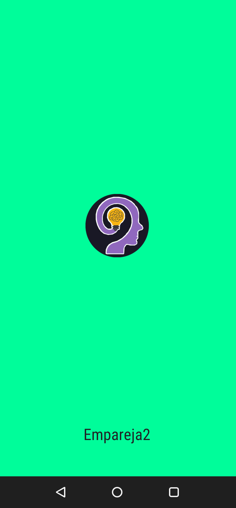

# Projec Memorize Game

## Table of Contents

* [Overview](#overview)
* [How to Play](#how-to-play)
* [Player UI Feature](#player-ui-features)
* [Screenshots](#screenshots)
* [Tech](#tech)
* [Authors](#authors)
* [License](#license)

## Overview

*'Projec Memorize Game'* was created for the Front-End challenge of the *'Full Stack Development - Intermediate'* course of the [Universidad Distrital Francisco José de Caldas](https://www.udistrital.edu.co/). The objective of the challenge is to demonstrate mastery of the main Front-End technologies (HTML, CSS and JavaScript).

You can play the game here --> [Projec Memorize Game](https://dilson24.github.io/Project-Memorize-Game/)
## Resumen
*'Projec Memorize Game'* fue creado para el reto Front-End del curso *Desarrollo Full Stack - Intermedio'* de la [Universidad Distrital Francisco José de Caldas](https://www.udistrital.edu.co/). El objetivo del reto es demostrar el dominio de las principales tecnologías Front-End (HTML, CSS y JavaScript).

Puedes jugar aquí --> [Projec Memorize Game](https://dilson24.github.io/Project-Memorize-Game/)

## How to play 
This game is a browser-based card game that presents the player with cards arranged in a grid, where the easy level has a 4x4 grid containing 8 matching symbols, the medium level has a 6x4 grid containing 12 matching symbols and the hard level has a 6x6 grid containing 18 matching symbols. The objective of the *'Emparejado2'* game is for the player to turn over pairs of matching cards in the shortest possible time using few moves. 
In a turn, if the player chooses two cards whose symbols match, the matched symbols will be shown. However, if the player chooses two cards with different symbols, both cards will be flipped over again. The game ends when all pairs of matching cards have been revealed.

## ¿Cómo jugar?
Este juego es un juego de cartas basado en el navegador que presenta al jugador cartas dispuestas en una cuadrícula, en donde el nivel fácil tiene una cuadrícula de 4x4 que contiene 8 símbolos iguales, el nivel medio tiene una cuadrícula de 6x4 que contiene 12 símbolos iguales y en nivel difícil tiene una cuadrícula de 6x6 que contiene 18 símbolos iguales. El objetivo del Juego de 'Emparejado2' es que el jugador de la vuelta a pares de cartas iguales en el menor tiempo posible usando pocos movimientos. 
En un turno, si el jugador elige dos cartas cuyos símbolos coincidan, se mostraran los símbolos emparejados. Sin embargo, si el jugador elige dos cartas con símbolos diferentes, ambas volverán a voltearse. El juego termina cuando se han descubierto todos los pares de cartas iguales.

## Player UI Features
In addition to the basic gameplay, several user interface components have been implemented to provide the player with features that enhance the overall experience.
to provide the player with features that enhance the overall experience.
* Play button: This button allows the player to enter the game interface and also displays a pop-up window that retrieves the player's name which will then be displayed in the game interface.
* How to Play button: This button displays a pop-up window that gives the player information about how to play.
* Pop-up windows: These pop-up windows are eye-catching and allow the player to get information and customize their game experience.
* Gear button: This button allows the player to display a hidden menu with different buttons to customize their game experience.
* Home button: This button is located in the drop-down menu and redirects the player to the home page.
* How to Play button: This button is located in the drop-down menu and displays a pop-up window that gives the player information about how to play the game.
* Change Difficulty button: This button is located in the drop-down menu and displays a pop-up window that allows the player to change difficulty (Easy, Medium and Hard).
* Rename button: This button is located in the drop-down menu and displays a pop-up window that allows the player to change the name displayed in the game interface.
* Reset button: This button is located in the drop-down menu and allows the player to reset the board, timer and moves.
* Timer - A timer that displays the number of minutes and seconds that have elapsed. The timer stops when the player wins the game. During the game if the player does not have the window active the timer stops and restarts running when it is active. Also if the player is in a game and displays the menu it stops and restarts running when the menu is hidden.
* Move counter - Displays the number of moves the player has made.
* Page title: This is a function that shows the player an eye-catching page title to catch his attention when he does not have the window active.
* Animations: During the player's stay he will be able to display different animations that make a more entertaining game experience (buttons, cards).

## Funciones de la interfaz del jugador
Además del juego básico, se han implementado varios componentes de interfaz de usuario
para ofrecer al jugador funciones que mejoren la experiencia general.
* Botón jugar: Este botón permite al jugador entrar a la interfaz del juego y además despliega una ventana emergente que obtiene el nombre del jugador que luego se mostrara en la interfaz del juego.
* Botón ¿Cómo Jugar?: Este botón muestra una ventana emergente que le da al jugador información acerca de cómo jugar.
* Ventanas emergentes: Estas ventanas emergentes son llamativas y permiten al jugador obtener información y personalizar su experiencia de juego.
* Botón engranaje: Este botón permite al jugador desplegar un menú oculto con diferentes botones para personalizar su experiencia de juego.
* Botón inicio: Este botón se encuentra en el menú desplegable y redirige al jugador a la página principal.
* Botón ¿cómo Jugar?: Este botón se encuentra en el menú desplegable y muestra una ventana emergente que le da al jugador información acerca de cómo jugar.
* Botón cambiar dificultad: Este botón se encuentra en el menú desplegable y muestra una ventana emergente que le permite al jugador cambiar de dificultad (Fácil, Medio y Difícil).
* Botón cambiar nombre: Este botón se encuentra en el menú desplegable y muestra una ventana emergente que le permite al jugador cambiar el nombre que se muestra en la interfaz del juego.
* Botón de reinicio: Este botón se encuentra en el menú desplegable y le permite al jugador reiniciar el tablero, el temporizador y los movimientos.
* Temporizador - Un temporizador que muestra el número de minutos y segundos que han transcurrido. El temporizador se detiene cuando el jugador gana la partida. Durante el juego sí el jugador no tiene la ventana activa el temporizador se detiene y vuelve a correr el tiempo cuando está activa. También si el jugador está en una partida y despliega el menú este se detiene y vuelve a correr el tiempo cuando el menú se oculta.
* Contador de movimientos - Muestra el número de movimientos que el jugador ha realizado.
* Título de página: Esta es una función que muestra al jugador un título de página llamativo para captar su atención cuando no tiene la ventana activa.
* Animaciones: Durante la estancia del jugador podrá visualizar distintas animaciones que hacen una experiencia de juego más entretenida (botones, cartas).
## Screenshots
### Home

### Memorize Game

### Responsive

### PWA Desktop

### PWA Movil

## Tech
- [HTML5] - HyperText Markup Language, versión 5.
- [CSS] - Cascading Style Sheets.
- [JavaScript] -  Interpreted programming language.
- [PWA] - Progressive web applications.
- [SweetAlert2] - *jQuery* plugin and with which we can give a professional look to the messages we send to users according to current trends.
- [Font Awesome] - Font Awesome is a font and icon toolkit based on CSS and Less.
- [Animate.css] - Library of ready-to-use, cross-browser animations for use in your web projects. Great for emphasis, home pages, sliders, and attention-guiding hints.
## Tecnologías
- [HTML5] - Lenguaje de marcado de hipertexto, versión 5.
- [CSS] - Hojas de estilo en cascada.
- [JavaScript] - Lenguaje de programación interpretado.
- [PWA] - Aplicaciones web progresivas.
- [SweetAlert2] - Plugin *jQuery*  con el que podemos dar un aspecto profesional a los mensajes que enviamos a los usuarios según las tendencias actuales.
- [Font Awesome] - Font Awesome es un conjunto de herramientas de fuentes e iconos basado en CSS y Less.
- [Animate.css] - Biblioteca de animaciones listas para usar y compatibles con todos los navegadores para utilizar en tus proyectos web. Ideal para énfasis, páginas de inicio, deslizadores y sugerencias para llamar la atención.

## Authors
- [@Dilson24](https://www.github.com/Dilson24) - Coding and documentation.
## License
**Free Software, Hell Yeah!**
[MIT](https://choosealicense.com/licenses/mit/) © 2023 - Dilson Alexander Cruz Nivia

 [JavaScript]: <https://lenguajejs.com/>
 [HTML5]: <https://lenguajehtml.com/html/>
 [CSS]: <https://lenguajecss.com/css/>
 [PWA]: <https://web.dev/i18n/es/progressive-web-apps/>
 [SweetAlert2]: <https://sweetalert.js.org/>
 [Font Awesome]: <https://fontawesome.com/>
 [Animate.css]: <https://animate.style/>
